# PROPO — Architecture

## 1. Two builds, one codebase

| | MVP (this repo, runs today) | Production target |
|---|---|---|
| Frontend | React 19 + TypeScript, hand-written design system (`src/styles.css`), bundled by esbuild into one HTML file | Next.js App Router + TypeScript + Tailwind (tokens from `src/styles.css` map 1:1 to `tailwind.config` theme) |
| Auth | Local demo account (no password stored) | Supabase Auth (email + Google OAuth), sessions, MFA for admins |
| Database | Browser `localStorage` (metadata) + IndexedDB (page texts and original files) | Postgres on Supabase EU (`db/schema.sql`), RLS per workspace |
| Files | IndexedDB | Supabase Storage / S3, private bucket, signed URLs (`server/storage/files.ts`) |
| Parsing | pdf.js, DOCX/XLSX/ZIP readers in the browser | Same parsers in a worker + OCR (`server/pipeline/ocr.ts`) |
| Retrieval | BM25 in the browser | pgvector (HNSW) + Postgres full-text, hybrid, filtered by `workspace_id` |
| AI | Claude via the claude.ai Artifact `sample` capability, when opened inside claude.ai; rule-based fallback elsewhere | OpenAI (structured outputs) behind a provider interface (`server/ai/openaiProvider.ts`) |
| Jobs | In-page async with progress | Trigger.dev / Inngest (`server/pipeline/jobs.ts`) |
| Billing | Interface only, no payments (`src/lib/services/billing.ts`) | Stripe Checkout + Customer Portal + webhooks (`server/billing/stripe.ts`) |
| Analytics | Local event log (Admin → Event stream) | PostHog EU (`docs/ANALYTICS.md`) |

Everything the UI needs goes through small service boundaries (`lib/actions.ts`, `lib/ai/provider.ts`, `lib/services/*`), so moving to the production backend replaces implementations, not screens.

## 2. AI pipeline

```mermaid
flowchart LR
  A[Upload\nPDF · DOCX · XLSX · ZIP] --> B[Parsing / OCR]
  B --> C[Chunking\nper page + clause]
  C --> D[Metadata\ndoc · page · clause]
  D --> E[Embeddings / retrieval]
  E --> F[Requirement extraction\nstructured JSON]
  F --> G[Validation\nquote must exist on cited page]
  G --> H[Company knowledge matching\nevidence ids must exist]
  H --> I[Proposal structure\nfrom tender + criteria]
  I --> J[Section generation\nsources only, citations]
  J --> K[Validation\nunknown citations dropped · price leak · uncited]
  K --> L[Human review\nDraft → AI generated → Reviewed → Approved]
```

**Never the whole PDF to the model.** Pages are ranked by requirement signals (modal verbs, points, deadlines, annexes, exclusion wording) and sent in ≤ 115k-character batches with `<<<DOC "name" | PAGE n>>>` headers so every item comes back with a page reference.

**Anti-hallucination rules, enforced in code, not only in prompts:**
1. Every requirement carries a verbatim quote. `quoteOnPage()` checks it against the cited page; failures are marked *Extraction uncertain* and lowered to 0.55 confidence.
2. The model may only cite company evidence by id; ids that do not exist are dropped. A *critical* requirement (price, experience, certifications, legal, financial) is never marked fulfilled without real evidence.
3. Drafts use only numbered sources `[S1]…[Sn]`. Markers that don’t exist are removed and the confidence is capped. Missing facts are written as `[Information required: …]`.
4. A regex check blocks price information in technical sections (exclusion risk in public tenders).
5. Only `approved_content` goes into the final package as final; anything else is watermarked DRAFT.
6. PROPO never proposes prices and never submits.

**Separation of layers** (tables in `db/schema.sql`): `source_documents/document_chunks` (what the tender says) · `company_*`, `vault_documents` (what the company has proven) · `generated_content` (AI output, versioned with model and prompt version) · `approved_content` (what a person signed off).

**Fallback without AI.** `extractWithRules()` finds requirements by wording, criteria by “N points”, dates near deadline wording, budget, CPV and page limits. In production it runs as a cross-check: items found by rules but missed by the model are added for review.

## 3. Multi-tenancy & security

- Workspace = company. Every table has `workspace_id`; RLS policies use `is_member(workspace_id, role)`.
- Roles: owner, admin, editor, reviewer. Billing and members: admin+. Approvals: reviewer+.
- Service-role access only in webhooks and jobs, always filtering by `workspace_id`.
- Files in a private bucket under `{workspace_id}/…`; downloads via 60-second signed URLs after a membership re-check; every download logged.
- Encryption: TLS in transit; AES-256 at rest (Supabase/S3).
- Audit log is append-only (no update/delete grant).
- Deletion: document, project, account; storage objects removed; backups purge in 30 days. Retention job for closed projects (`data_retention_months`).
- AI providers under DPA, EU residency / zero retention where available; customer data never used for training.
- No certifications are claimed. ISO 27001 / ENS are roadmap items.

## 4. GDPR

Privacy policy, terms and cookie policy drafts (`/privacy`, `/terms`, `/cookies`, placeholders marked for counsel). In-product: export all data (JSON), delete account (typed confirmation), retention setting, audit log, “never used for training” statement. Sub-processor list to be published.

## 5. Plans & cost control

See `docs/PRICING.md`. Limits live in `src/lib/plans.ts` (UI) and `server/billing/stripe.ts#LIMITS` (enforced server-side). Units shown to customers: *proposals per month* and *pages per proposal*. AI actions per proposal are an internal fair-use cap.

## 6. Búsqueda de licitaciones (TED + PLACSP)

| | MVP | Producción |
|---|---|---|
| Fuente | Instantánea real de la API de búsqueda de TED v3, 30/09/2026 (`src/lib/discovery/tedSnapshot.ts`), ~60 anuncios publicados en España | Sincronización diaria de TED (`server/discovery/ted.ts`) y de la fuente ATOM de PLACSP (`server/discovery/placsp.ts`), orquestada por `server/discovery/sync.ts` |
| Almacenamiento | En el código | `opportunities` (pública, compartida), `opportunity_matches`, `saved_opportunities`, `tender_alerts` (privadas, con RLS) |
| Compatibilidad | `matchTender()` en el navegador | La misma función en el job diario; resultado en `opportunity_matches` |
| Alertas | Se guardan; no envían correos | Resumen diario por alerta (`enqueue_alert_digests`) |

La compatibilidad (0–100) es determinista y explicable, sin IA: sector por prefijos CPV (50), región NUTS (15), importe frente a facturación de la empresa (20) y tiempo para preparar la oferta (15). Si el anuncio no publica el importe, el criterio se marca como desconocido y no puntúa: nunca se inventa. **Pliegos y resúmenes.** Para 27 de las 59 licitaciones (las publicadas en PLACSP y en la plataforma catalana), el MVP incluye enlaces directos a los pliegos oficiales (PCAP, PPT y anexos) y un resumen redactado con IA a partir de esos documentos el 1/10/2026, con la página de origen de cada dato (`src/lib/discovery/tenderDocs.ts`). Para el resto, el resumen se genera a partir del anuncio eForms de TED (`src/lib/discovery/brief.ts`). En producción, `server/discovery/pliegos.ts` descarga los pliegos de cada oportunidad relevante, los guarda en `opportunity_documents` y genera el resumen estructurado (`opportunity_briefs`) con citas verificadas.

«Analizar licitación» crea el proyecto en un clic con la ficha oficial y, para 33 licitaciones, con los pliegos en PDF publicados junto a la app (`pliegos/<id>/`, manifiesto en `src/lib/discovery/pliegoFiles.ts`). Después, el asistente «PROPO te pregunta» (`src/lib/interview.ts`) conversa con el usuario para resolver los requisitos clave y los datos de empresa que faltan, y redacta todas las secciones. Desde la pestaña «Documentos del pliego» se añaden después el PCAP y el PPT, y el proyecto se vuelve a analizar con el texto completo.

## 7. Designed for later (not in the MVP)

Descarga automática de pliegos desde PLACSP, análisis de adjudicaciones y competidores, puntuación de propuestas, flujos de revisión con comentarios, firma electrónica, integraciones (Drive, Microsoft 365, Slack, HubSpot, Salesforce) y presentación automática donde sea legalmente posible (siempre con confirmación humana). El esquema mantiene `projects.type`, `approved_answers.embedding` y `jobs` genéricos para añadir esto sin migrar las tablas principales.
